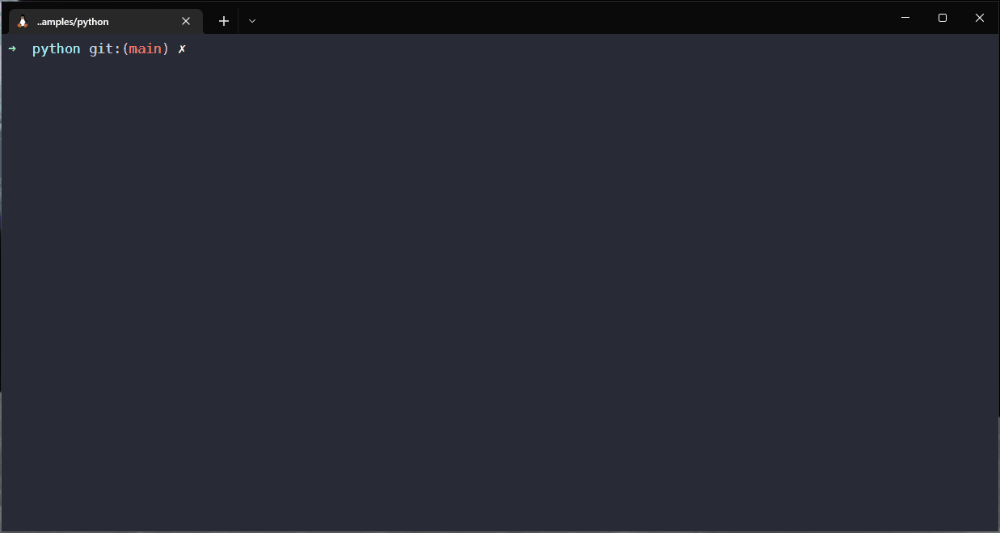

# FHIR Terminology Samples

This repository accompanies the presentation "Working with FHIR Terminology Services - From A Coder's Perspective" by Joshua Wiedekopf, given at the Workshop "Accessing and Using a Terminology Services", organized by the MeDIC at the University of Cologne within the Medical Informatics Initiative in Germany on 2021-07-05.

The presentation is available [in this repository](./working-with-fhir-ts.pdf). In the top-left corner of the presentation, the presenter notes are available as well, but GitHub does not render them directly. Open the PDF in another PDF reader to read the notes (Chromium's PDF engine, as well as Adobe Reader work).

## In this Repository

This repository contains a number of exemplars that demonstrate the use of the FHIR R4 APIs for Terminology Services (TS). They are designed to be run against an instance of Ontoserver, such as the one maintained at the University of Cologne at https://terminology-highmed.medic.medfak.uni-koeln.de/fhir/ (a DFN-issued certificate is required for access). They should be compatible with any server implementing the FHIR R4 TS specification. You can override the URL with any other endpoint, such as https://r4.ontoserver.csiro.au/fhir

The samples in this repository are not to be considered "best practices" and their use in any productive setting should be considered risky.

You will find the following directories in this repository:

- `python`: The primary implementation is the one in Python, where all of the use cases in the linked presentation are implemented. It uses `requests` and `fhir.resources` for FHIR operations.
- `java`: The Java implementation utilizes the HAPI FHIR library and client to access the server. Only authentication using mutual TLS, listing of `CodeSystems` and conversion from SQLite to FHIR CodeSystem are implemented at this time.
- `spring`: Within Spring Boot, it might be advisable to utilize Spring-native facilities for REST requests. Hence, this project demonstrates mostly how to obtain a Spring REST Template that can be used for FHIR requests against a mutual TLS-secured endpoint. The patterns for working with the server are similar to those in Python (build relative URLs using the patterns provided by the FHIR spec), and those in Java (utilize HAPI FHIR to parse the responses and access them using POJOs)
- `nginx/nginx-standalone-proxy`: This snippet can be used to configure any NGINX web server to transparently handle mutual TLS authentication, e.g. against the above endpoint.
- `nginx/varnish-nginx`: This folder contains a `docker-compose` stack for setting up a caching proxy that transparently handles authentication against mutual TLS endpoints, and exposes the above University of Cologne (http://localhost/koeln/fhir/) and CSIRO (http://localhost/csiro/fhir) over HTTP. Caching TTL is set for one hour to ensure that changes on the upstream propagate to the cache. Varnish is used as the HTTP cache, while nginx handles HTTPS/TLS termination. The Varnish configuration is very simplistic and should not be used in production as-is (automatic refresh, different TTL, conditional TTLs are not considered, and the endpoint is only exposed over HTTP)!

## Python: Usage

You will need a recent Python 3 executable on your `$PATH`, and the `venv` module should be installed. The script `setup-venv.sh` facilitates setting up the Python virtual environment for this script.

You will find the following exemplars:

- `authz/test_authorization`: A very simple demo on how to accomplish Mutual TLS authentication, and for parsing JSON to FHIR resources, by requesting the name and version of the remote endpoint via its conformance statement.
- `get_session.py`: A selection of helper functions in the class `FhirApi` that provides easy access to the configured endpoint. This file can not be run stand-alone.
- `list_resources.py`: List the CodeSystems available on the server
- `validate_code.py`: Validate that a code is contained within a CodeSystem
- `validate_code_valueset.py`: Validate that a `(code, system)` pair is contained within a ValueSet
- `list_codes_valueset.py`: Demonstrates `ValueSet/$expand` with an optional filter to show how a list of codes can be provided to the user
- `expand_ecl.py`: Expand a ECL expression against a user-selectable edition and version of SNOMED CT
- `create_resources.py`: Convert the exemplary relational database `../legacydb.sqlite3` (containing a table with local laboratory codes, some of which are mapped to LOINC) to a `CodeSystem` for the local codes, a `ValueSet` for the LOINC codes (with validation!), and a `ConceptMap` for mapping from local codes to LOINC.

Run the scripts in a Bash terminal in a Unix-like system as such:

```bash
./setup-venv.sh
source venv/bin/activate
python list_resources.py
```

The `create_resources.py` example looks like this when executed:



## Java: Usage

The Java exemplars are build using Gradle. In IntelliJ IDEA, you should be able to import the project and build it as-is. Then, run the respective script using the "Play" buttons in the left-hand margin of the files which define a `main` method:

- `authentication/Authenticate.java`: Same as in Python: print the name and version of the remote endpoint
- `listresources/ListResources.java`: List the CodeSystems on the server
- `createresources/ConvertResources.java`: Convert the same SQLite database to FHIR resources

The class `fhirwrapper/FhirClientWrapper.java` is used to obtain an instance of the HAPI FHIR Context, and for obtaining REST clients for access of the endpoint.

## Spring: Usage

The Spring project is also built using Gradle.

There is a bean for requesting the FHIR Context, and a `RestTemplate` bean that is configured for mutual TLS authentication. The REST template is wrapped in a service to encapsulate FHIR requests. 

Via Spring MVC, the following endpoints are exposed via HTTP:

- `GET /metadata`: present the FHIR metadata as indented JSON
- `GET /metadata/version`: Print the FHIR Server name and version, as with Python and Java.

In a Spring Boot app, you would generally do things similar to the Java implementation, so these exemplars only show the bare minimum to get started.

